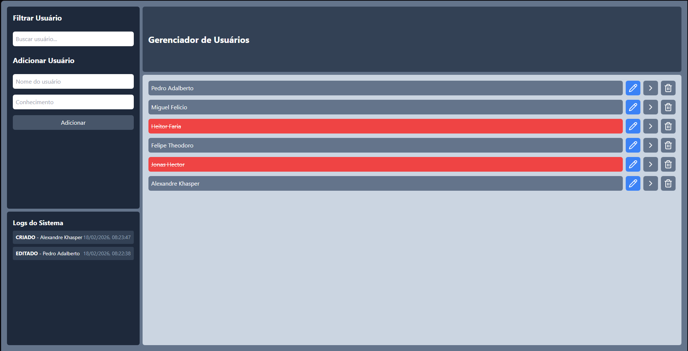

# React + Vite

# Gerenciador de Usuários

Sistema CRUD desenvolvido em React.

## 📸 Preview



## 🚀 Tecnologias

- React
- TypeScript
- TailwindCSS
- UUID
- LocalStorage

## 📌 Funcionalidades

- Criar usuários
- Editar usuários
- Excluir usuários
- Filtro por nome
- Logs persistentes
- Modal de edição

## 📂 Estrutura

- components/
- pages/
- App.tsx

## 💾 Persistência

Dados e logs armazenados no LocalStorage.


```bash
npm install
npm run dev
